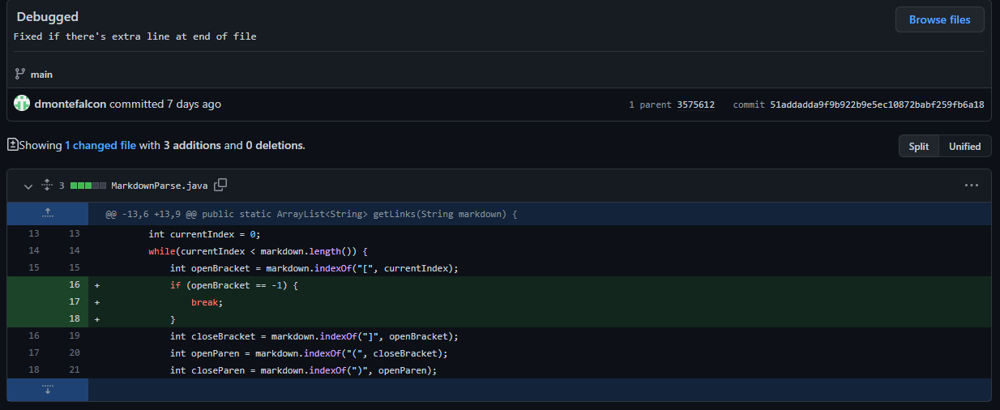
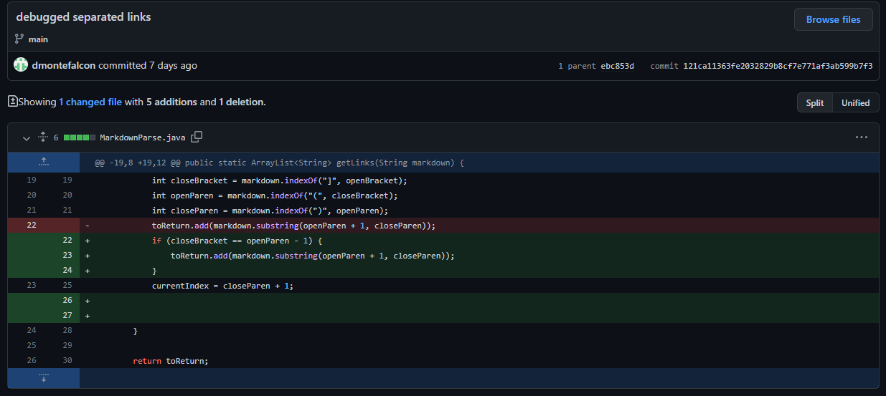
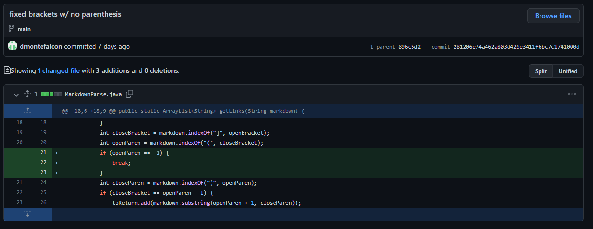

# CSE 15L Week 4 Lab Report

## Code Change 1

[Failure Inducing Test File](https://github.com/AndrewKahr/markdown-parser/blob/main/test-file2a.md)  
### Symptom
Expected: `[https://github.com/dmontefalcon/markdown-parser, https://youtube.com]`  
Actual:
```
Exception in thread "main" java.lang.OutOfMemoryError: Java heap space
        at java.base/java.util.Arrays.copyOf(Arrays.java:3512)
        at java.base/java.util.Arrays.copyOf(Arrays.java:3481)
        at java.base/java.util.ArrayList.grow(ArrayList.java:237)
        at java.base/java.util.ArrayList.grow(ArrayList.java:244)
        at java.base/java.util.ArrayList.add(ArrayList.java:454)
        at java.base/java.util.ArrayList.add(ArrayList.java:467)
        at MarkdownParse.getLinks(MarkdownParse.java:19)
        at MarkdownParse.main(MarkdownParse.java:30)
```
### Description
This bug was caused due to an infinite loop triggered when the file doesn't end with a link. The test input purposely added an extra newline at the end, thus the program wouldn't exit. Since it can't find it, it loops infinitely to find a bracket that doesn't exist, thus causing a heap space error. Thus our fix was to end the loop if it can't find an opening bracket.

## Code Change 2

[Failure Inducing Test File](https://github.com/AndrewKahr/markdown-parser/blob/main/test-file3a.md)  
### Symptom
Expected: `[]`  
Actual: `[https://google.com]`  

### Description
This bug was caused due to not validating the indexes of the ending bracket and opening parenthesis being right next to each other. We made a test file with a space between the closing bracket and opening parenthesis which shouldn't be treated as a link anymore, however, our implementation still treated it as a link which caused it to output `https://google.com`. Once we added a check to make sure the closing bracket and open parenthesis were consecutive, we passed our test.

## Code Change 3

[Failure Inducing Test File](https://github.com/AndrewKahr/markdown-parser/blob/main/test-file4a.md)

### Symptom
Expected: `[https://gmail.com]`  
Actual: 
```
Exception in thread "main" java.lang.OutOfMemoryError: Java heap space
        at java.base/java.util.Arrays.copyOf(Arrays.java:3512)
        at java.base/java.util.Arrays.copyOf(Arrays.java:3481)
        at java.base/java.util.ArrayList.grow(ArrayList.java:237)
        at java.base/java.util.ArrayList.grow(ArrayList.java:244)
        at java.base/java.util.ArrayList.add(ArrayList.java:454)
        at java.base/java.util.ArrayList.add(ArrayList.java:467)
        at MarkdownParse.getLinks(MarkdownParse.java:19)
        at MarkdownParse.main(MarkdownParse.java:30)
```
### Description
This bug is similar to the first bug, however in this case, it was now looking for an opening parenthesis that didn't exist for the fake link. The markdown was designed specifically to trick the program into the infinite loop by denying it the expected parenthesis. To fix the issue, we modified the code to check whether it couldn't find another parenthesis and stop the loop if it can't.
