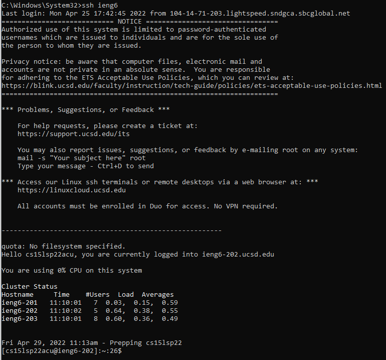

# CSE 15L Week 6 Lab Report

This week, we were given three options for tasks in lab 5. They included optimizing our SSH configuration to allow for connecting to remote servers using an alias instead of typing out the full username and servername, setting up Github access on ieng6 using an SSH key for authentication, and using `scp -r` to copy entire directories recursively to a remote server.

## Streamlining SSH Configuration
  
I used notepad to edit my config as seen above.
  

## Setup Github Access from ieng6
Public Key on Github

Private Key on ieng6

Committing and Pushing with SSH Key

[Link to Commit](https://github.com/AndrewKahr/cse15l-lab-reports/commit/2d7ee8ad8490d2435a77edbc36bf5f8c5df0d355)

## Copy Whole Directories with `scp -r`
SCP a whole directory and other files recursively

SSH into the system and compile

SCP and Compilation in one command

**Command to SCP and Compile the code in one step:**
`ssh -t ieng6 "bash --login -c 'mkdir -p ~/markdown-parse'" && scp -r lib/ *.java *.md ieng6:~/markdown-parse && ssh -t ieng6 "bash --login -c 'cd markdown-parse && javac -cp .:lib/junit-4.13.2.jar:lib/hamcrest-core-1.3.jar MarkdownParseTest.java && java -cp .:lib/junit-4.13.2.jar:lib/hamcrest-core-1.3.jar org.junit.runner.JUnitCore MarkdownParseTest'"` 

Note the `bash --login -c` was to get the system path setup since non-interactive shells do not seem to get the proper Java paths setup.
