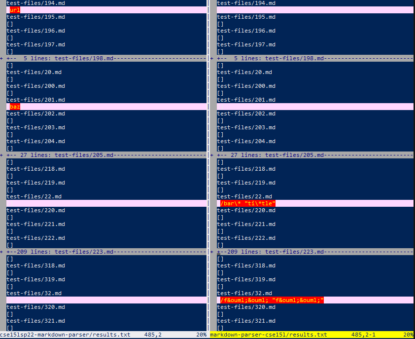
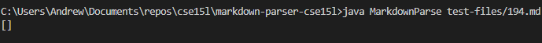
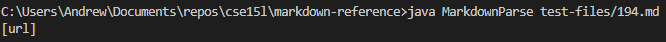
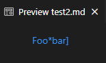
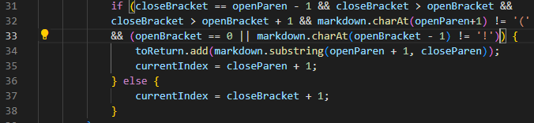
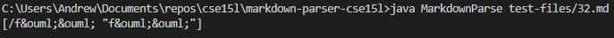
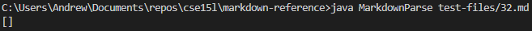
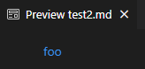

# CSE 15L Week 8 Lab Report

# Finding the Differing Results
First I ran both implementations of the markdown parsers and wrote the output into a `results.txt` file. Then I ran vimdiff on both `results.txt` files which showed the differences between outputs. I then manually inspected the vimdiff for red which indicates differences between the results and chose two differences.

# Test Files
[194.md](https://github.com/nidhidhamnani/markdown-parser/blob/main/test-files/194.md)   
[32.md](https://github.com/nidhidhamnani/markdown-parser/blob/main/test-files/32.md)

# Test 194
Neither implementation was correct.  
My Implementation:  
  
Reference Implementation:  
  
Expected Output:  
  
Expected: [my_(url)]  

My Implementation Code:  
  

In my implementation, I need an additional check to see if the bracket is followed by an additional bracket and a colon. If it is, it should treat all text until the next space as the link, rather than have it give up when the opening parenthesis isn't found immediately after the closing bracket. I would also start breaking these checks into functions to make it more readable and make the logic more managable.

# Test 32
My Implementation:  
  
Reference Implementation:  
  
Expected Output:  
  
Expected: [föö]

My Implementation Code:  
  

In my implementation, I detected the link, however I need to stop reading the link when a space is detected. Thus in line 34, the substring should first be trimmed to remove extra spaces/newlines, then be split by space and the first element in the split string list should be used as the link.

